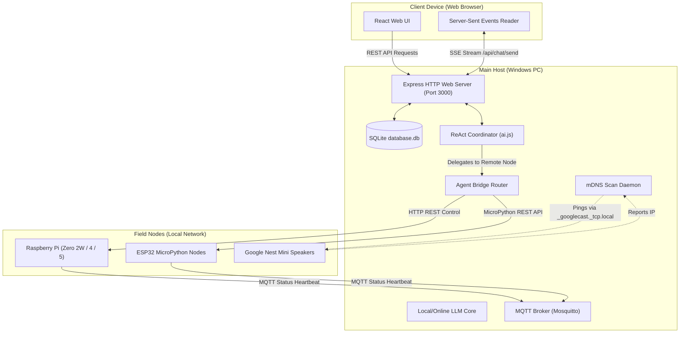

# PATTI — Enterprise Suite (v5.3.0)

<p align="center">
  
</p>

[](https://github.com/jjuhric/private_ai/wiki)
[](LICENSE)
[](README.md)

A highly secure, private personal AI assistant dashboard built with React (Vite) and Node.js (Express). PATTI features a ReAct multi-agent orchestration coordinator, live deep web scraping, real-time Google News summaries, persistent SQLite memory storage, task scheduling, system telemetry, and a mobile-responsive layout.

Version `5.3.0` introduces the **Hermes MQTT Node Mesh & Auto-Updater**, enabling a unified, local mesh network where a Windows main host automatically discovers and updates local network nodes (Raspberry Pi/ESP32) and coordinates smart speakers (Google Nest Mini) dynamically.

---

## 🏗️ System-Wide Architecture

The PATTI Assistant splits functionality into a React frontend client, a Node.js backend supervisor, and distributed remote field nodes. The database (SQLite) holds user preferences, calendar events, messages, memories, and registered network nodes.



---

## ⚙️ Device Setup & Deployment

PATTI operates in a distributed network. Setup instructions differ based on the device role. For a comprehensive walkthrough covering setting up LM Studio, Ollama, GitHub Personal Access Tokens, Windows background tasks, and Raspberry Pi systemd configurations, see the [Installation Guide Wiki Page](https://github.com/jjuhric/private_ai/wiki/Installation).

### 🔍 Core Setup Requirements
- **Name & Zipcode**: Gained during initialization to personalize briefings and weather forecasts.
- **GitHub Personal Access Token (PAT)**: **(REQUIRED)** Required to fetch tool repository components and download code updates.
- **Local LLM (LM Studio / Ollama)**: **(REQUIRED)** The system defaults entirely to your Local LLM. Online API keys (e.g. Gemini) are optional fallbacks.
- **Working Directory**: **(REQUIRED)** The absolute local directory path where code files are saved and compiled. Dynamically resolved on startup and configurable in Settings.

---

### 1. Windows Main Host (Running LLMs)
The Windows PC acts as the central brain. It runs the local LLM integration, coordinates multi-agent loops, and maintains the primary database.

> [!WARNING]  
> **Strict Approval Mode**: On Windows, all system modification tools (like running scripts, writing files, and executing commands) are locked down and require explicit Human-In-The-Loop (HITL) UAC approval before execution.

#### Setup Steps:
1. **Prerequisites**: Install Node.js (`v25.5.0` or higher), Git, and LM Studio/Ollama.
2. **Install & Setup**:
   Open PowerShell as Admin and run:
   ```powershell
   git clone https://github.com/jjuhric/private_ai.git
   cd private_ai
   Set-ExecutionPolicy Bypass -Scope Process -Force
   .\setup.ps1
   ```
   Follow the setup prompts to input your name, zipcode, local LLM URL, and GitHub token.
3. **Launch Development Servers**:
   ```powershell
   npm run dev
   ```
4. **Setup Wizard**: Access `http://localhost:3000` to launch the Setup Wizard. Choose **Windows** as the device type during initialization.

---

### 2. Raspberry Pi Node (Zero 2W, 3, 4, or 5)
Raspberry Pi nodes run lightweight backend endpoints to read telemetry (CPU temp, INA219 current/power draw), perform local GPIO manipulation, or run system-level shell scripts. They publish periodic heartbeats via MQTT to register themselves on the host database.

#### Setup Steps:
1. **Prepare Node environment**:
   ```bash
   git clone https://github.com/jjuhric/private_ai.git
   cd private_ai
   chmod +x setup.sh
   ./setup.sh
   ```
   Provide the IP address of your Windows Main Host when prompted, and select the Raspberry Pi model.
2. **Configure MQTT Connection**:
   Modify `node_client/.env` to point `MQTT_BROKER_URL` to your main host's MQTT broker IP (e.g. `mqtt://192.168.1.50:1883`).
3. **Service Management**:
   The script installs a systemd background service `private-ai.service` that starts client.js and announces heartbeats to `nodes/heartbeat` every 60 seconds.
   - Check Status: `sudo systemctl status private-ai`
   - Restart: `sudo systemctl restart private-ai`
   - Logs: `journalctl -u private-ai -f`

---

### 3. ESP32 Node (MicroPython)
ESP32 microcontrollers serve as low-power, cheap sensor nodes or relay controls communicating over WiFi.

#### Setup Steps:
1. **Prepare MicroPython**: Flash MicroPython onto your ESP32 board.
2. **Configure WiFi & Setup**:
   Open `esp32_firmware/config.py` and input your local WiFi SSID, Password, and your main host's MQTT broker address:
   ```python
   WIFI_SSID = "Your_WiFi"
   WIFI_PASSWORD = "Your_Password"
   MQTT_BROKER = "192.168.1.50"
   ```
3. **Deploy Firmware**:
   Copy `esp32_firmware/main.py` onto your ESP32 device as `main.py` using tools like Thonny, Adafruit-AMPY, or mpremote. When it boots, it will publish heartbeats to `nodes/heartbeat` and listen on port `80`.

---

## 🚀 How to Interact with PATTI

### 1. Dynamic Network Mesh Checking
Go to **Agent Dashboard** -> **Field Nodes** tab to manage your smart home mesh:
* **Auto-Discovery & Heartbeats**: Raspberry Pi and ESP32 nodes configured with the MQTT broker URL will automatically check in via heartbeats and populate. If a node ceases sending heartbeats, it is hidden from the dashboard to keep the view clean.
* **Simplified Health Status**: Devices show a simplified **Healthy** or **Not Healthy** pill indicating their overall operational state.
* **Device & Router Filtering**: The network scanner automatically filters out duplicate IP addresses and gateway router IPs (e.g. `192.168.1.1`), ensuring only actionable local devices are shown.
* **Google Nest Speaker Priority**: Headless Google Nest/Cast devices are discovered via mDNS and prioritised as `google_home` node signatures.
* **Scan Network & Polling**: The network is polled automatically every 15 minutes. You can trigger a live scan at any time using the **Scan Network** button.

### 2. Speaking on Google Nest Speakers
You can send TTS messages directly from the assistant. Simply say:
- *"Say 'Good morning' on the Office Nest Mini"*
- *"Tell the Living Room Speaker to announce dinner is ready"*
The system automatically queries the `network_nodes` table to route the audio file to the correct target IP without hardcoded configurations.

### 3. Background Auto-Updating
The host daemon checks origin commits every hour. If updates exist, it pulls them, compiles dependencies for both frontend and backend, and exits safely. A system daemon configuration (e.g. PM2 or Systemd) should be set up to auto-restart `server.js` on exit:
```bash
# Recommended host process command using PM2:
pm2 start backend/server.js --name "patti-backend" --watch
```

---

## 🧪 Testing & Code Coverage

To run the full suite:
```bash
npm test
```
* **Unit & Integration Tests**: Covers routers, DB migrations, RAG vault tools, agent routing, and remote bridge payloads.
* **Coverage Requirements**: Strict enforcement of **90% statement and line coverage** via Jest (backend) and Vitest (frontend).
