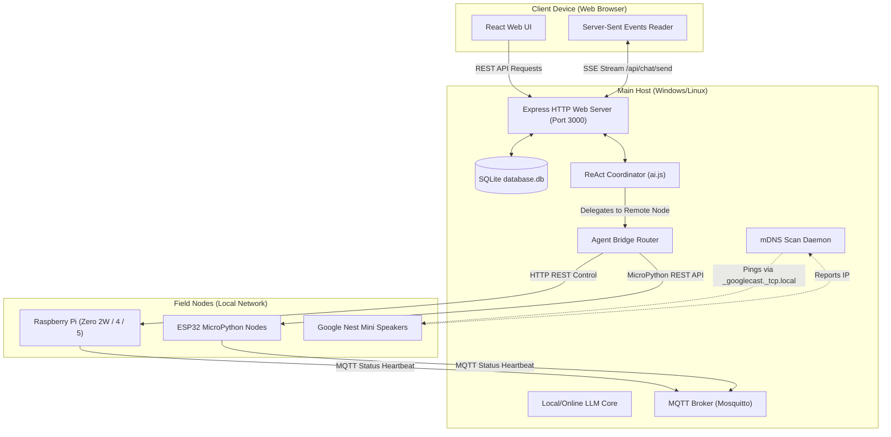

# PATTI — Private AI Assistant (v5.3.0)

<p align="center">
  
</p>

[](https://github.com/[USER]/private_ai/wiki)
[](LICENSE)
[](README.md)

**PATTI** (Professional Artificial Text and Type Intelligence) is a local-first, multi-agent personal AI assistant. A **Supervisor Agent** reads each request and routes it to a specialized worker agent — weather, calendar, local system control, web search, your own document vault, code editing, and more — rather than handling everything in one giant, error-prone prompt. It runs primarily against a **local LLM** (LM Studio or Ollama) on your own hardware, with optional, explicitly opt-in fallback to an online provider (Gemini, OpenAI, or Anthropic Claude) if you choose to add a key in Settings.

New to the codebase or teaching from it? The **[Wiki](https://github.com/[USER]/private_ai/wiki)** is written as a full explainer — it covers not just how to run PATTI, but *why* it's built the way it is, in enough depth to learn from as a real-world example of a multi-agent system, a REST API, an auth flow, and a local vector search pipeline. This README is deliberately just the summary.

---

## What it does

- **Multi-agent orchestration** — a Supervisor Agent classifies each request and delegates to the right specialist (weather, calendar, system control, developer/coder, memory, document vault, sports/news, and more).
- **Local-first, cloud-optional** — defaults entirely to a local LLM; online providers are never used unless you explicitly enable them in Settings and supply your own API key.
- **Human-in-the-loop safety** — before running a shell command or writing a file, the assistant pauses and asks for your explicit approval.
- **Local semantic memory (RAG)** — uploaded documents and stored memories are embedded locally (no data leaves your machine) and retrieved by meaning, not just keyword match.
- **Local device mesh** — a Windows/Linux main host coordinates lightweight Raspberry Pi and ESP32 field nodes over MQTT, and can discover and cast text-to-speech announcements to Google Nest/Cast speakers on the LAN.
- **Dynamic tool registry** — new tools can be authored, tested, and mounted into the running agent system at runtime without a rebuild.

---

## Architecture at a glance



The React (Vite) frontend talks to a Node.js/Express backend over REST and Server-Sent Events. SQLite holds users, chats, memories, calendar events, and node registrations. Field nodes (Raspberry Pi, ESP32) announce themselves over MQTT and can be queried/controlled through a signed bridge API. See **[Architecture](https://github.com/[USER]/private_ai/wiki/Architecture)** in the Wiki for the full breakdown, including why each technology was chosen and how the agent delegation pipeline works end to end.

---

## Quick start (Windows main host)

1. Install [Node.js](https://nodejs.org/) v22+, [Git](https://git-scm.com/), and [LM Studio](https://lmstudio.ai/) or [Ollama](https://ollama.com/).
2. Load a local model and start its server (LM Studio: **Local Server** tab → **Start Server**).
3. ```powershell
   git clone https://github.com/[USER]/private_ai.git
   cd private_ai
   Set-ExecutionPolicy Bypass -Scope Process -Force
   .\setup.ps1
   ```
4. Open `http://localhost:3000` and complete the Setup Wizard.

Raspberry Pi / ESP32 field nodes, MQTT mesh setup, and full environment variable reference: see **[Installation](https://github.com/[USER]/private_ai/wiki/Installation)**.

### LAN HTTPS (Android/PWA install)

To run PATTI over HTTPS on your LAN (for better mobile install behavior):

```powershell
npm run lan:https:start
```

This starts the backend and a local Caddy reverse proxy at `https://192.168.1.42`.

To stop both:

```powershell
npm run lan:https:stop
```

If this is your first run, install and trust Caddy's local root cert on your phone:

`%APPDATA%\Caddy\pki\authorities\local\root.crt`

---

## Testing

```bash
npm test              # backend (Jest) + frontend (Vitest)
npm run test:e2e       # Playwright end-to-end
npm run coverage        # coverage report, 70% statement/line threshold enforced
```

---

## Learn more

| Page | What it covers |
| --- | --- |
| **[Home](https://github.com/[USER]/private_ai/wiki)** | Project overview, what problem it solves, and how to use the wiki as a learning resource |
| **[Architecture](https://github.com/[USER]/private_ai/wiki/Architecture)** | Full system topology, technology choices and why, agent delegation pipeline, security boundaries |
| **[Installation](https://github.com/[USER]/private_ai/wiki/Installation)** | Step-by-step setup for every device role, full `.env` reference |
| **[Usage](https://github.com/[USER]/private_ai/wiki/Usage)** | How to actually use the assistant day to day |
| **[Codebase Documentation](https://github.com/[USER]/private_ai/wiki/Codebase-Documentation)** | What every folder and file does and why it's designed that way |
| **[Contributing](https://github.com/[USER]/private_ai/wiki/Contributing)** | How to author and mount a custom tool |
| **[FAQ](https://github.com/[USER]/private_ai/wiki/FAQ)** | Common setup and troubleshooting questions |

## License

MIT — see [LICENSE](LICENSE).
