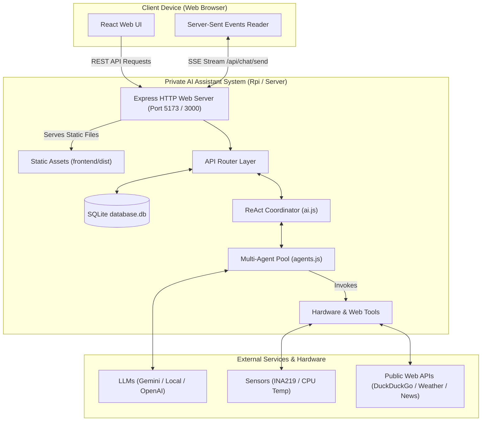

# Private AI Assistant — Enterprise Suite (v3.0.0)

A secure, private personal AI assistant dashboard built with React (Vite) and Node.js (Express). Features a ReAct multi-agent orchestration coordinator, live deep web scraping, real-time Google News summaries, persistent SQLite memory storage, task scheduling, system telemetry, and a mobile-responsive layout.

This application is designed to run locally, on private home servers, or on a **Raspberry Pi 5** using a single-port production server configuration.

---

## 🏗️ System-Wide Architecture

The Private AI Assistant splits functionality into a React frontend client and a Node.js backend server. The database (SQLite) holds user preferences, calendar events, messages, and memories.



For in-depth sub-system details:
- **Backend Architecture & APIs**: See the [backend/README.md](file:///c:/Users/jjuhr/OneDrive/Documents/private_ai/backend/README.md) file.
- **Frontend Components & State**: See the [frontend/README.md](file:///c:/Users/jjuhr/OneDrive/Documents/private_ai/frontend/README.md) file.

---

## 🌟 Key Features

1. **Dual AI Core (Local & Online)**: Integrates local offline LLM runtimes (LM Studio, Ollama) and commercial API providers (Google Gemini, Anthropic, OpenAI) with a visual model selector.
2. **ReAct Multi-Agent Coordinator**: A sequential Reasoning and Action loop that coordinates specialized sub-agents:
   - **Supervisor**: Manages task delegation and final compiled answers.
   - **Memory Agent**: Retains, recalls, and updates user preferences.
   - **Web Searcher & Scraper**: Searches DuckDuckGo/Wikipedia and decodes Google News RSS feeds to extract full article text.
   - **Calendar Handler**: Coordinates meeting schedule database CRUD.
   - **Coder & QA Engineer**: Performs file manipulation and executes test suites.
   - **Weather Expert**: Connects to OpenWeatherMap to deliver forecasts.
   - **Host Specialist**: Reads system configurations and telemetry.
3. **Hardware Telemetry Drivers**:
   - **INA219 Current/Power Monitor**: Reads voltage, current, and power over the I2C bus with a 3-sample average and simulated fallback.
   - **CPU Temperature Sensor**: Reads hardware thermal zone data with a 3-sample average and Celsius/Fahrenheit conversion.
4. **Mobile Responsive UI**: Collapsible drawer sidebars, mobile hamburger navigation, sliding settings panels, and touch-optimized form layouts.
5. **Quality Assurance Gate**: Automatic testing integration that enforces a minimum **95% code coverage** (lines and statements) in Jest and Vitest.

---

## ⚙️ Installation & Setup

### Prerequisites
- **Node.js**: Version `25.5.0` or higher.
- **Git**: Installed and configured.

### 1. Install Dependencies
Run the unified script from the root directory to install all dependencies for both the frontend and backend:
```bash
npm run install:all
```

### 2. Configure Environment Variables
Create your local environment file:
```bash
cp .env.example .env
```
Open `.env` and configure your credentials:
```env
PORT=5173
JWT_SECRET=use_a_long_secure_secret_phrase_here
DB_PATH=backend/database.db
```

---

## 🚀 Deployment on Raspberry Pi 5

To run the application in a single-port production server layout:

### Automated Setup & Update
We provide an automated shell script that pulls code, installs dependencies, builds static files, and installs/updates a background `systemd` service:
```bash
# Execute setup (requires sudo privileges for service registration)
./setup.sh
```

Manage the background service using systemd:
- **Check Status**: `sudo systemctl status private-ai`
- **View Live Logs**: `journalctl -u private-ai -f`
- **Restart Service**: `sudo systemctl restart private-ai`

### Manual Production Build
1. Compile the optimized React static assets:
   ```bash
   npm run build
   ```
2. Start the Express server in production mode:
   ```bash
   npm start
   ```
The Express server will launch on port `5173` (as specified in your `.env`) and serve the built React files directly from `frontend/dist` on:
`http://localhost:5173`

---

## 🛠️ Development Mode

To run hot-reloading development servers for the frontend and backend concurrently:
```bash
npm run dev
```
- **Frontend Dev Server**: Runs on `http://localhost:5173` (proxies `/api` requests to the backend).
- **Backend Dev Server**: Runs on `http://localhost:3000`.

---

## 🧪 Testing & Code Coverage

The project maintains a strict quality gate, enforcing a **95% code coverage** threshold.

Run the test suites:
- **Backend Tests (Jest)**: `npm run test:backend`
- **Frontend Tests (Vitest)**: `npm run test:frontend`
- **End-to-End Tests (Playwright)**: `npm run test:e2e`
- **All Tests**: `npm test`
- **Generate Coverage Reports**: `npm run coverage`
