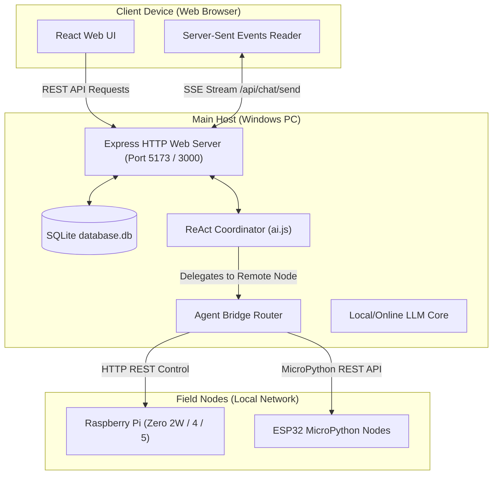

# Private AI Assistant — Enterprise Suite (v4.5.0)

<p align="center">
  
</p>

[](https://github.com/jjuhric/private_ai/wiki)
[](LICENSE)
[](README.md)

A highly secure, private personal AI assistant dashboard built with React (Vite) and Node.js (Express). Private AI features a ReAct multi-agent orchestration coordinator, live deep web scraping, real-time Google News summaries, persistent SQLite memory storage, task scheduling, system telemetry, and a mobile-responsive layout.

Version `4.3.0` introduces the **Multi-Device Hermes Network Architecture**, enabling a unified, local mesh network where a Windows main host coordinates and delegates hardware/control tasks to distributed Raspberry Pi and ESP32 field nodes.

---

## 🏗️ System-Wide Architecture

The Private AI Assistant splits functionality into a React frontend client, a Node.js backend supervisor, and distributed remote field nodes. The database (SQLite) holds user preferences, calendar events, messages, memories, and registered network nodes.



---

## ⚙️ Device Setup & Deployment

Private AI operates in a distributed network. Setup instructions differ based on the device role. For a comprehensive walkthrough covering setting up LM Studio, Ollama, GitHub Personal Access Tokens, Windows background tasks, and Raspberry Pi systemd configurations, see the [Installation Guide Wiki Page](https://github.com/jjuhric/private_ai/wiki/Installation).

### 🔍 Core Setup Requirements
- **Name & Zipcode**: Gained during initialization to personalize briefings and weather forecasts.
- **GitHub Personal Access Token (PAT)**: **(REQUIRED)** Required to fetch tool repository components and download code updates.
- **Local LLM (LM Studio / Ollama)**: **(REQUIRED)** The system defaults entirely to your Local LLM. Online API keys (e.g. Gemini) are optional fallbacks.
- **Working Directory**: **(REQUIRED)** The absolute local directory path where code files are saved and compiled. Dynamically resolved on startup and configurable in Settings.

### 1. Windows Main Host (Running LLMs)
The Windows PC acts as the central brain. It runs the local LLM integration, coordinates multi-agent loops, and maintains the primary database.

> [!WARNING]  
> **Strict Approval Mode**: On Windows, all system modification tools (like running scripts, writing files, and executing commands) are locked down and require explicit Human-In-The-Loop (HITL) UAC approval before execution.

#### Setup Steps:
1. **Prerequisites**: Install Node.js (`v25.5.0` or higher), Git, and LM Studio/Ollama.
2. **Install & Setup**:
   Open PowerShell as Admin and run:
   ```powershell
   git clone https://github.com/jjuhric/private_ai.git
   cd private_ai
   Set-ExecutionPolicy Bypass -Scope Process -Force
   .\setup.ps1
   ```
   Follow the setup prompts to input your name, zipcode, local LLM URL, and GitHub token.
3. **Launch Development Servers**:
   ```powershell
   npm run dev
   ```
4. **Setup Wizard**: Access `http://localhost:3000` to launch the Setup Wizard. Choose **Windows** as the device type during initialization.

---

### 2. Raspberry Pi Node (Zero 2W, 3, 4, or 5)
Raspberry Pi nodes run lightweight backend endpoints to read telemetry (CPU temp, INA219 current/power draw), perform local GPIO manipulation, or run system-level shell scripts.

#### Setup Steps:
1. **Prepare Node environment**:
   ```bash
   git clone https://github.com/jjuhric/private_ai.git
   cd private_ai
   chmod +x setup.sh
   ./setup.sh
   ```
   Provide the IP address of your Windows Main Host when prompted, and select the Raspberry Pi model.
2. **Service Management**:
   - Check Status: `sudo systemctl status private-ai`
   - Restart: `sudo systemctl restart private-ai`
   - Logs: `journalctl -u private-ai -f`

---

### 3. ESP32 Node (MicroPython)
ESP32 microcontrollers serve as low-power, cheap sensor nodes or relay controls communicating over WiFi.

#### Setup Steps:
1. **Prepare MicroPython**: Flash MicroPython onto your ESP32 board.
2. **Configure WiFi & Setup**:
   Open `esp32_firmware/main.py` and input your local WiFi SSID and Password inside the `main()` connection block.
3. **Deploy Firmware**:
   Copy `esp32_firmware/main.py` onto your ESP32 device as `main.py` using tools like Thonny, Adafruit-AMPY, or mpremote.

---

## 🚀 How to Interact with Private AI

### 1. Setup Wizard
When launching Private AI for the first time, you are greeted by an automated setup wizard:
* **Step 1: Device Selection**: Identify the current device family (Windows, Raspberry Pi variants, ESP32 variants).
* **Step 2: Profile Settings**: Configure personal settings, system name, and location.
* **Step 3: Model Configuration**: Configure preferred online (Gemini/OpenAI/Claude) and local models.
* **Step 4: Review & Deploy**: Validates and saves configurations to the SQLite DB.

### 2. Multi-Agent Supervisor & Agents Pool
Through the central chat pane, the **Supervisor Agent** acts as the primary coordinator, delegating tasks to various specialized agents:
- **Mesh Communication & Routing**: Connected peripheral devices (Raspberry Pis, ESP32s) can communicate and execute commands on each other freely. However, the central Windows Main Host is protected: it can query its own system telemetry locally, but no remote node is allowed to query information or execute commands on the Main Host.
- **Model Selector Agent**: Dynamically routes requests to the optimal model based on the active provider. When offline, it evaluates the currently loaded model's capability versus the time cost (~10-30s) to JIT-load another local model. When online, it routes between cheap/fast `gemini-2.5-flash` and powerful/expensive `gemini-2.5-pro` depending on task complexity to maximize performance while minimizing API cost.
- **LM Studio Live Logs Viewer**: Streams CLI logs in real-time to the main host's dashboard via Server-Sent Events (SSE). It includes source filters for isolation (`ALL`, `SERVER`, `MODEL`) and automatically stops the CLI daemon stream when the page is closed or the tab is switched.
- **GitHub Agent**: Performs GitHub operations such as creating branches, committing files, and generating pull requests. It has strict security constraints blocking repository creation and direct updates to the `main` or `master` branches of any repository.
- **Tool Creation Agent**: Orchestrates dynamic tool development. It drafts a **Tool Plan** (saved in the workspace as `plan.md`) describing the goal, risks, affected parts, and files to touch, pauses coordinator execution to request user permission (requiring a `yes`/`no` response), and then implements, tests, and deploys it. System-specific (local betterment) tools are automatically added to `.gitignore`, while general tools are shared via the `private_ai_tools` repository.
- **Agent Creation Agent**: Designs and integrates new agents on the fly. It constructs an **Agent Plan** detailing the prompt, integration points, risk, and registry updates (saved as `agent_[name]_plan.md`), obtains user permission, and automatically edits files (`agents.js` and `ai.js`) and database capabilities.
- **Coder & QA Nodes**: The Developer Agent and QA Engineer build and verify dynamic tool/agent packages securely.

### 3. Network Nodes Registry Dashboard
Navigate to **System Control** -> **Field Nodes** tab to manage your smart home mesh:
* **Add Node**: Provide the node name, select the device type (RPi, ESP32, Windows), input its local IP address, and specify its bridge auth token.
* **Status Monitoring**: Live green/red online dots automatically ping remote nodes to ensure they are online.
* **Remove Node**: Cleanly delete nodes from your distributed registry.

---

## 🛠️ Auto-Update Workflow

To automatically update when changes are pushed to `main`, configure a GitHub webhook pointing to `/api/update`.
* The server verifies webhook payloads using GitHub's **HMAC-SHA256 signature** validation based on `UPDATE_WEBHOOK_SECRET`.
* Under `DEPLOY_MODE=backend-only`, updates pull commits and execute `npm install` without rebuilding the React client, preventing memory overload on weak nodes like RPi Zero 2W.
* On full hosts, it rebuilds frontend bundles and restarts the underlying system service.

To update manually on any platform, simply execute:
```bash
npm run update
```

---

## 🧪 Testing & Code Coverage

To run the full suite:
```bash
npm test
```
* **Unit & Integration Tests**: Covers routers, DB migrations, RAG vault tools, agent routing, and remote bridge payloads.
* **Coverage Requirements**: Strict enforcement of **90% statement and line coverage** via Jest (backend) and Vitest (frontend).
