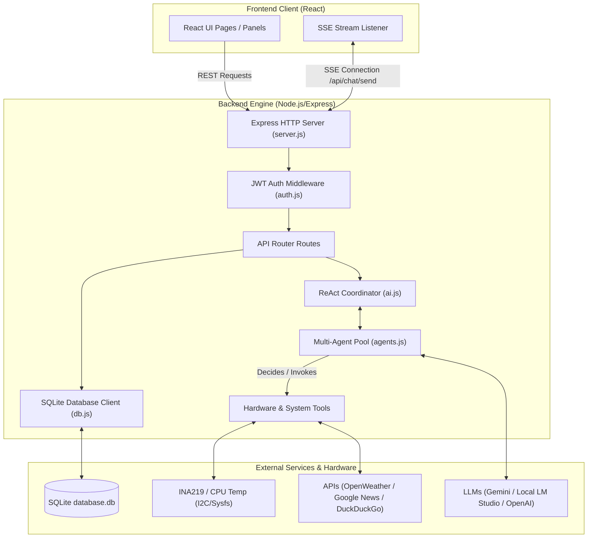
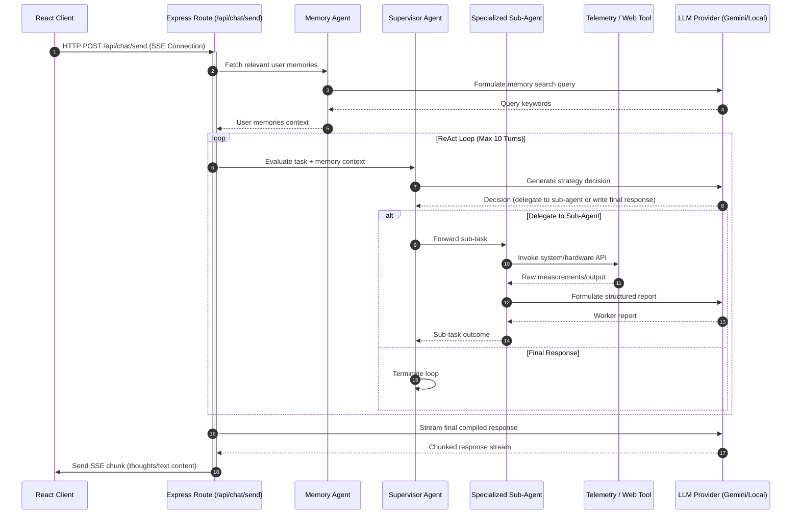
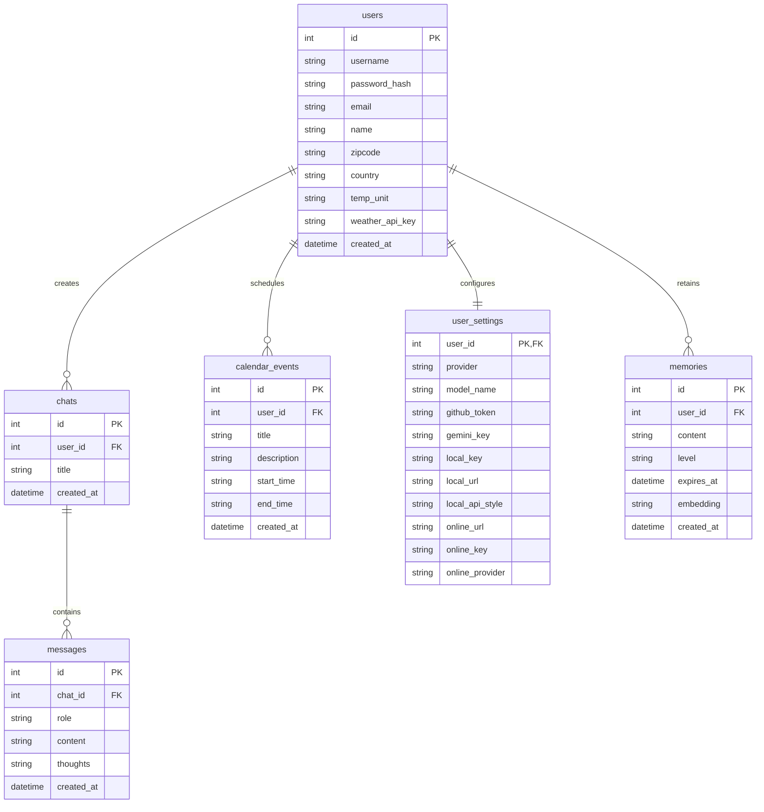

# Private AI Assistant — Backend System (v3.0.0)

The backend of the Private AI Assistant is a high-performance, secure Node.js system powered by Express and SQLite. It coordinates a multi-agent ReAct intelligence loop, handles real-time Server-Sent Events (SSE) streaming, integrates hardware-level telemetry, and exposes a secure REST API.

---

## 🏗️ Architecture & Component Flow

The backend orchestrates requests from the React frontend, queries local hardware sensors or local/online LLMs, and updates local state databases.

---

## 🤖 Multi-Agent ReAct Coordinator

At the core of the backend is the **Multi-Agent Coordinator** (`backend/ai.js` & `backend/utils/agents.js`). It implements a sequential **Reasoning and Action (ReAct)** loop.

### Coordinator Loop Process
1. **Pre-Run Memory Check**: Before invoking the main coordinator, the **Memory Agent** queries the SQLite database for relevant past memories and inserts them into the supervisor's prompt.
2. **Supervisor Decision**: The **Supervisor Agent** evaluates the user request and decides whether to output a final response or delegate to a specialized worker sub-agent.
3. **Execution Turn & Human Pauses**: The coordinator runs the loop for up to 10 turns. If a sub-agent returns `INPUT_REQUIRED_FROM_USER: [message]`, the coordinator intercepts the message, streams it to the user, and immediately terminates the current turn to pause for user input.
4. **Responder Streaming**: Once the supervisor finishes, the accumulated reasoning and final response are streamed chunk-by-chunk to the client using Server-Sent Events.

### Specialized Agents Pool
- **Supervisor**: Orchestrates sub-agents, decides strategy, and generates final user-facing reports.
- **Memory Agent**: Performs memory operations (`remember`, `recall`, `forget`) to maintain persistent user context.
- **Web Searcher**: Conducts deep Google/DuckDuckGo/Wikipedia searches and decodes Google News URLs for RSS scraping.
- **Calendar Handler**: Coordinates meeting and task management in the local database.
- **Coder**: Implements directory analysis, local file read/writes, and runs project terminal tasks.
- **QA Engineer**: Audits source code and runs the test suites.
- **Weather Expert**: Connects to OpenWeatherMap to retrieve detailed forecasts.
- **Host Specialist**: Reads system hardware configurations, battery status, and CPU temperatures.
- **GitHub Agent**: Manages branches, commits changes, and generates pull requests on GitHub, with strict constraints blocking repository creation or direct changes to `main`/`master` branches.
- **Tool Creation Agent**: Designs and coordinates new tool additions. It creates a plan, prompts the user via the supervisor for a `yes`/`no` approval, and coordinates with Developer/QA nodes to implement and test the new tool.

---

## 📊 SQLite Database Schema

The SQLite database (`backend/database.db`) stores user configuration, sessions, calendar events, memories, and chat logs.

---

## 🔌 Hardware Telemetry Drivers

The backend contains native drivers for physical devices, designed for deployability on Raspberry Pi.

### INA219 Current & Voltage Monitor (`backend/tools/ina219_tool.js`)
- Communicates directly over the I2C bus (`/dev/i2c-1`) utilizing the `i2c-bus` package.
- Auto-calibrates for a `16V, 5A` operating range.
- **3-Sample Averaging**: Takes 3 distinct samples (separated by 2-second sleep intervals) and computes the average current (A), bus voltage (V), power draw (W), and battery percentage.
- **Simulation Fallback**: If I2C hardware is missing (such as during dev on Windows/macOS), it switches to a simulated telemetry mode that returns fluctuating mock values, preventing script crashes.

### CPU Temperature Monitor (`backend/tools/temp_tool.js`)
- Queries hardware sensors using two approaches:
  1. Executes the Raspberry Pi utility command: `vcgencmd measure_temp`
  2. Reads from standard Linux thermal zone files: `/sys/class/thermal/thermal_zone0/temp`
- **3-Sample Averaging**: Samples temperature 3 times with 1-second sleep intervals.
- **Dual Conversion**: Computes both Celsius and Fahrenheit values for each sample and the final average.
- **Simulation Fallback**: If thermal sensors are inaccessible, it runs in simulated mode, producing fluctuating temperatures (centered around ~42.5°C).

---

## 📡 REST API Reference

### 🔐 Authentication (`/api/auth`)
- `POST /register`: Registers a new user. Expects `username` and `password`.
- `POST /login`: Log in to retrieve a signed JWT token (httpOnly cookie).
- `POST /logout`: Clears the authentication token cookie.
- `GET /session`: Verifies the JWT and returns the active user session.

### 👤 Profile (`/api/profile`)
- `PUT /update`: Updates user profile settings (name, email, zipcode, country, temp_unit, weather_api_key).

### ⚙️ Settings (`/api/settings`)
- `GET /`: Retrieves the user settings (LLM configurations, model selections, and API keys).
- `PUT /update`: Updates LLM configurations, local base URLs, and active model names.

### 📅 Calendar (`/api/calendar`)
- `GET /list`: Retrieves all registered calendar events for the active user.
- `POST /add`: Creates a new event. Expects `title`, `start_time`, `end_time`, and `description`.
- `DELETE /delete/:id`: Removes the calendar event by database ID.

### 💬 Chats & SSE (`/api/chat`)
- `GET /list`: Retrieves a list of active chat sessions.
- `GET /messages/:chatId`: Retrieves all messages in a specific chat session.
- `POST /send`: Main streaming endpoint. Establishes a Server-Sent Events channel. Receives the user prompt, runs the ReAct coordinator loop, streams `<think>` tags and content, and saves messages to the database.
