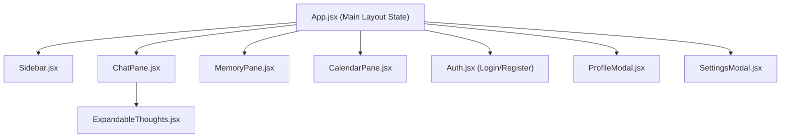
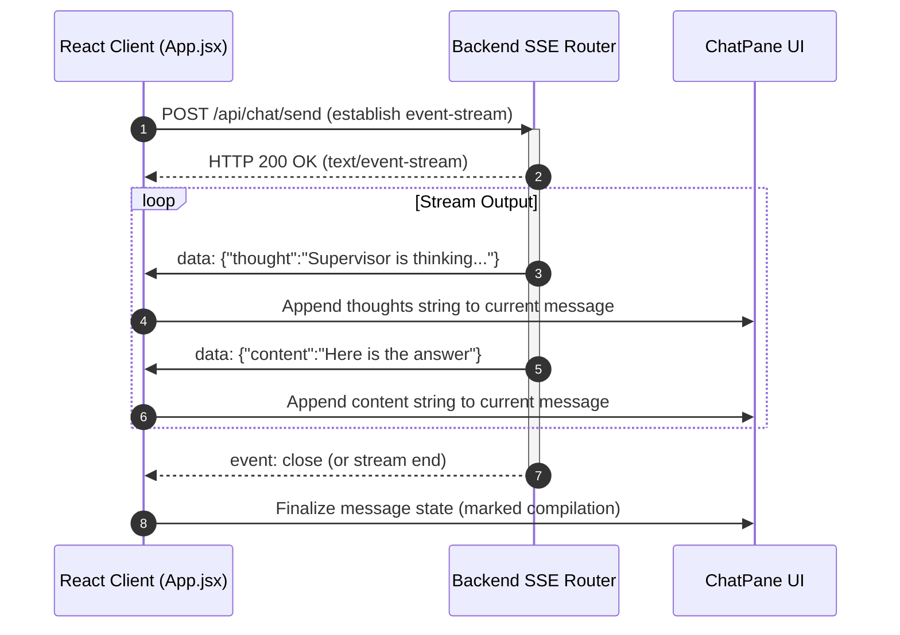

# PATTI — Frontend Client (v3.0.0)

The frontend of PATTI is a high-performance, single-page application (SPA) built with React and Vite. It features a responsive, glassmorphic layout, a real-time SSE stream renderer, and state-synchronized configuration modals.

---

## 🌳 Component & Modal Structure

The React layout uses a unified state orchestrator (`App.jsx`) that coordinates child panes and configuration modal windows.

---

## 🎨 Layout, Navigation & Panels

The application uses a grid-based template structured around the collapsible sidebar and main action panels:

1. **Collapsible Sidebar (`Sidebar.jsx`)**:
   - Manages navigation between different application modes: Chat, Memories, and Calendar.
   - **Responsive Design**: On desktop, it is docked on the left. On mobile devices, it collapses off-screen and slides in from the left using a hamburger button overlay with a dark backdrop overlay.
2. **Main Application Panels**:
   - **Chat Feed Panel (`ChatPane.jsx`)**: Displays message transcripts. Incorporates the `ExpandableThoughts` component to isolate reasoning processes.
   - **Memory Manager Panel (`MemoryPane.jsx`)**: Connects to the memory agent. Allows users to register facts, look up user information, or delete expired records.
   - **Task Schedule Panel (`CalendarPane.jsx`)**: Displays scheduled calendar cards, supporting add/delete operations.

---

## 📡 Server-Sent Events (SSE) Streaming

The interface handles real-time response generation by parsing SSE chunked data streams (`GET /api/chat/send` equivalent):

### 🧠 Separating Thoughts from Response Content
AI models often generate reasoning tokens inside `<think>...</think>` tags. The frontend separates these segments:
- **Collapsible thoughts (`ExpandableThoughts.jsx`)**: Formats thinking processes inside expandable accordion blocks.
- **Main Response content**: Rendered as compiled markdown using `marked` for clean layout design (supporting code blocks, lists, and formatting).

---

## ⚙️ Settings & User Profiles

State management coordinates settings adjustments:

- **LLM Settings (`SettingsModal.jsx`)**:
   - Selects the active model provider (Local, Gemini, OpenAI, etc.).
   - Dynamically toggles required API keys, local base endpoints, and active model names.
   - Protects keys using secure toggles (eye/eye-closed toggles).
- **User Profile (`ProfileModal.jsx`)**:
   - Updates geographic credentials (zipcode and country code) to resolve regional weather forecasts.
   - Selects temperature preferences (°C or °F).
   - Stores user-scoped API keys (e.g. OpenWeatherMap keys).

---

## 📱 Mobile Responsiveness

The styling uses standard CSS rules to adapt across diverse screen sizes:

- **Viewport break points**: Max-width rules target mobile (`768px`) and tablet (`1024px`) sizes.
- **Hamburger toggle menus**: Triggers slide-out sidebars on mobile, ensuring clean viewport layouts.
- **Dynamic layouts**: Sidebar panels dynamically stack on mobile to prevent horizontal scrolling.
- **Touch-optimized inputs**: Form inputs use custom font sizes (minimum `16px`) to prevent automatic iOS zoom behaviors.
- **Glassmorphic styling**: Uses CSS variables, dark backdrops (`rgba(0,0,0,0.55)`), high-contrast text, and smooth CSS transitions (`cubic-bezier`).
